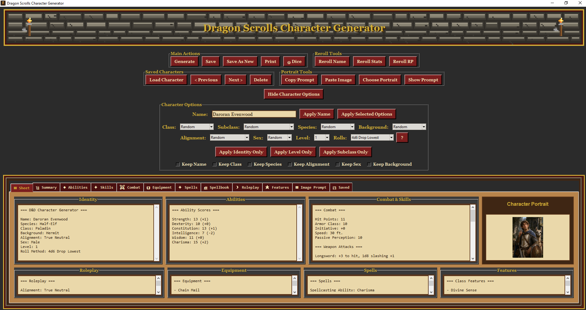
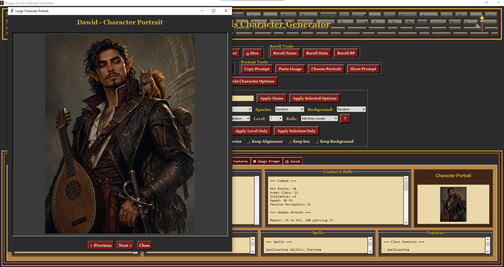
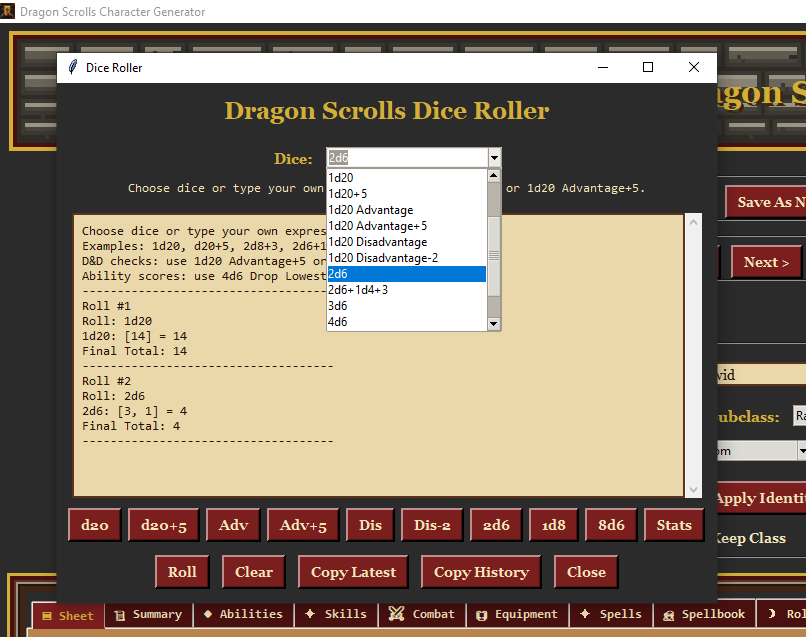

# Dragon Scrolls Character Generator

Dragon Scrolls is a retro fantasy tabletop RPG character generator built with Python and Tkinter.

It creates fantasy RPG characters with:

* species, class, subclass, background, alignment, and level
* ability scores and combat stats
* spells and class features
* roleplay traits
* portrait image prompts
* saved character loading, searching, sorting, and editing
* printable PDF character sheets
* a built-in dice roller

## Portrait Images and AI Image Prompts

Dragon Scrolls does not generate portrait images by itself.

Instead, it creates a detailed portrait prompt for each character. You can copy that prompt and paste it into your favorite image generator, such as ChatGPT, Grok, Copilot, Gemini, or another image generation tool.

The intended portrait workflow is:

1. Generate a character in Dragon Scrolls.
2. Click the portrait prompt/copy prompt option.
3. Paste the prompt into your preferred image generator.
4. Generate the character portrait outside Dragon Scrolls.
5. Save the image as a PNG, JPG, or similar image file.
6. Add that image back into Dragon Scrolls as the character portrait.

You can also skip AI image generation completely and use any normal image file you already have, such as a PNG or JPG character portrait.

Dragon Scrolls supports adding portrait images so they can be saved with the character and included in previews or exports.

## Project Roadmap and Changelog

Dragon Scrolls is under active development.

See the [ROADMAP.md](ROADMAP.md) file for planned features, future ideas, and the current project direction.

See the [CHANGELOG.md](CHANGELOG.md) file for version history and release notes.

## Status

This project is currently an early hobby release.

It works on Windows with Python 3.12, but it is still under active development.

## Download

The easiest way to try Dragon Scrolls on Windows is to download the latest Windows test package from the Releases page:

[Download Dragon Scrolls v0.1.1 Windows Test Package](https://github.com/afyoung3083/dragon-scrolls-character-generator/releases/tag/v0.1.1)

This is still a Python-based test release, not a full Windows installer.

## Screenshots

### Main Character Generator



### Saved Character Browser



### Dice Roller



## How to Run

### Windows Quick Start

This project is still a Python app, not a finished Windows installer yet.

For the easiest first run on Windows:

1. Download the latest Windows test package from the [Releases page](https://github.com/afyoung3083/dragon-scrolls-character-generator/releases/tag/v0.1.1).
2. Unzip the downloaded folder.
3. Open the unzipped project folder.
4. Double-click:

```text
Launch Dragon Scrolls.bat
